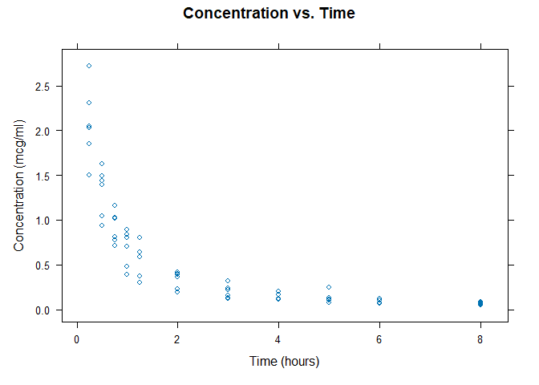
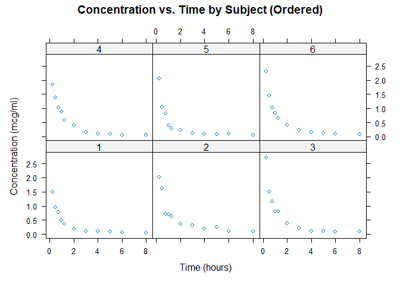
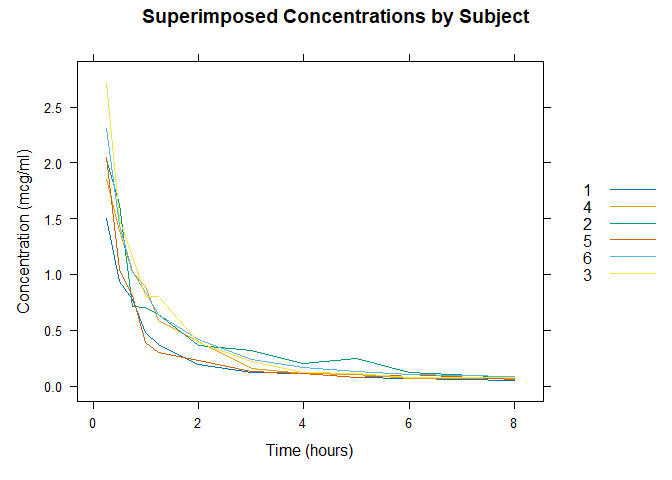
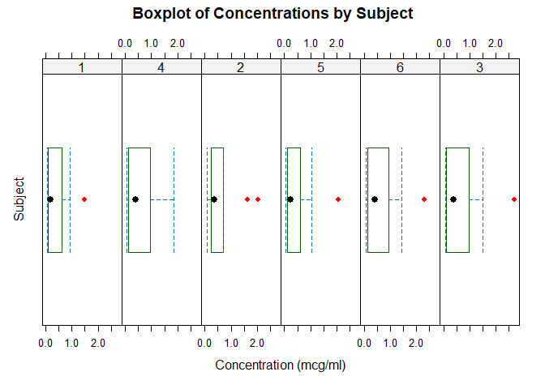

Plotting Indomethacin concentration
================

### Lattice introduction

``` r
suppressWarnings(library(lattice))
```

Let us load a dataset - Indometh. Indomethacin is a nonsteroidal
anti-inflammatory drug (NSAID) commonly used as a prescription
medication to reduce fever, pain, stiffness, and swelling from
inflammation.


``` r
data(Indometh)
df <- Indometh
head(df)
```

    ##   Subject time conc
    ## 1       1 0.25 1.50
    ## 2       1 0.50 0.94
    ## 3       1 0.75 0.78
    ## 4       1 1.00 0.48
    ## 5       1 1.25 0.37
    ## 6       1 2.00 0.19

### Concentration vs time plotting

``` r
xyplot(conc ~ time, data = df, type = "p",
       xlab = "Time (hours)", ylab = "Concentration (mcg/ml)",
       main = "Concentration vs. Time")
```

<!-- --> \### Let us
now visualize it separately for each subject.

``` r
xyplot(conc ~ time | factor(Subject, levels = 1:6), data = df, type = "p",
       xlab = "Time (hours)", ylab = "Concentration (mcg/ml)",
       main = "Concentration vs. Time by Subject (Ordered)")
```

<!-- -->

### Now let us look at superimposed trend lines.

``` r
xyplot(conc ~ time, data = df, groups = Subject, type = "l",
       xlab = "Time (hours)", ylab = "Concentration (mcg/ml)",
       main = "Superimposed Concentrations by Subject",
       auto.key = list(space = "right"))
```

<!-- -->

``` r
# auto.key = list(space = "right")) - adds legend to the right
```

## We are interested in finding out differences in the plasma concentration of Indomethicin amongst the six subjects.

``` r
bwplot(~ conc | Subject, data = df,
       xlab = "Concentration (mcg/ml)", ylab = "Subject",
       main = "Boxplot of Concentrations by Subject",
       par.settings = list(
         box.rectangle = list(col = "darkgreen", lty = 1),
         plot.symbol = list(col = "red", pch = 16),
         superpose.symbol = list(col = "blue", pch = 20)
       ),
       horizontal = TRUE,
       layout = c(6, 1)
       )  
```

<!-- -->
