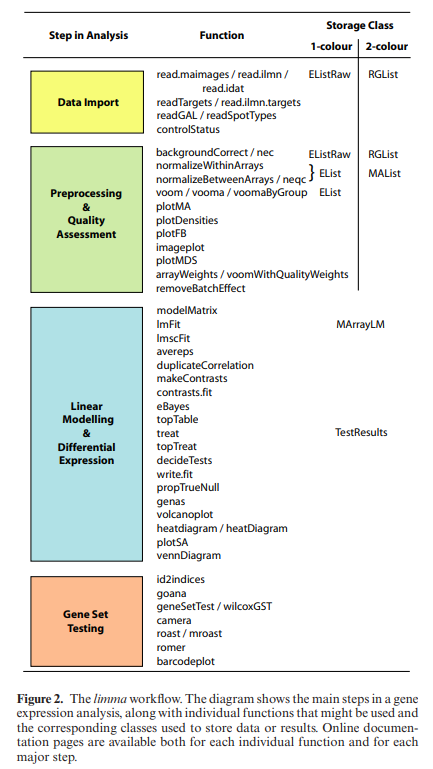
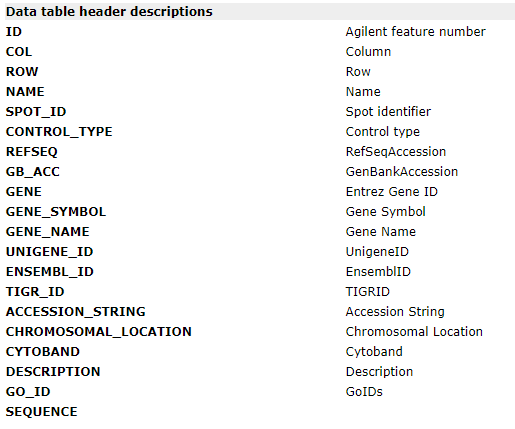

```{r setup, include=FALSE}
require("knitr")
knitr::opts_chunk$set(echo = TRUE)
knitr::opts_knit$set(root.dir = "C:/Users/weraz/Pictures/Sem6/R-bioconductor/tests/data/agilent")
getwd()
```

Working on data from ["Regional variation in gene expression in the healthy
colon is dysregulated in ulcerative colitis"](https://pubmed.ncbi.nlm.nih.gov/18523026/). -> **the largest published microarray study examining gene expression in IBD**

As in the study [Agilent-012391](https://gemma.msl.ubc.ca/arrays/showArrayDesign.html?id=321) Whole Human Genome Oligo Microarray G4112A was used with dual mode, we need to do 2-colour Agilent analysis.

One of the commercial microarrays for microRNA profiling has been developed by Agilent Technologies. Agilent microarrays use a single-color array protocol and combine a direct labelling method with innovatively designed, in situ-synthesized probes that have minimal sequence bias. [[source]](https://rnajournal.cshlp.org/content/13/1/151)

For each microRNA, the Agilent microRNA microarray platform makes measurements with a number of different oligonucleotide probes that are replicated a number of times across the array surface. These replicate signals are summarized into a total gene signal (TGS) with the proprietary Agilent Feature Extraction (AFE) image analysis algorithm [4], which makes use of the background corrected signals. [[source](https://bmcgenomics.biomedcentral.com/articles/10.1186/1471-2164-12-64#Tab1)]

This TGS could be used for the differential expression analysis without further pre-processing adjustments; however, different studies indicate that normalization of the microRNA data between arrays improves both sensitivity and specificity in comparison with non-normalized data. [[source](https://bmcgenomics.biomedcentral.com/articles/10.1186/1471-2164-12-64#Tab1)]

Agilent combines two-sample hybridization with the use of long (60-mer) oligonucleotides. These arrays are also hybridized with two different fluorescent samples and measurements of differential expression obtained from the relative abundance of hybridized mRNA. [[source]](https://bmcbioinformatics.biomedcentral.com/articles/10.1186/1471-2105-8-142)

I will follow limma workflow, that is:

<p align="center">
  <a href="https://watermark.silverchair.com/gkv007.pdf?token=AQECAHi208BE49Ooan9kkhW_Ercy7Dm3ZL_9Cf3qfKAc485ysgAAA0gwggNEBgkqhkiG9w0BBwagggM1MIIDMQIBADCCAyoGCSqGSIb3DQEHATAeBglghkgBZQMEAS4wEQQMRxrXITF3KC732EOZAgEQgIIC-9Ni4_p7IZTp1I4Jc3qwnZEx-QuAm6TKe6-Snx5_GL5y7WXiS3tZgOqcgHIRqeYYse_4_pWgnbg5wszIaZcur90aYUOhEFBpT-ywGO9eX5nddnVk_SeF-U9TNmvn0vkpa5E3alO6xBYmlzMvU6VK5Nf-PxUz2HXjSShgMeV9Fb_iTWla0LXVizSNlyUyh8cQR7k95-RrO3mQJJtP0p-fA0_0VMRTnCad1cBHjV7tbh_DiODlf6IsCBRTMIVEFwRZDjdAUyvdwnwBN0E1o307G0TR-1XS2PvZu5SPGUN3rfEn_PuNmLUlT_9VHEhuLcwooCnmp3e54gCF0f05Bhv7HUue5Wc2JnRa4n1Q8Z2kIxrJowUYkz9anjMuLAhBUa6ypIFXMcSb_-vjXtPVTTs9J8lI_2Ly-bOC5BPOuNnjjmtgGwG0RY48WsF8v9KUnS1zJqnNW3pUm95RGrBBfvlI78bd8N6W4cftvJwB_myz15ylVV5M4b__dG7U5voyh63tphxBBKdY4lwP9AYzapo0X_ocLER_bDH8rA1Unn9BXdB9wMEopvGcIrRag2k81oLOJZqdtsDHHPmyfzEilVElSgdkLdTsLmvCxItVvOBE_NWjnpIlvcJyJw_r5sZGjJMvmdDVZI51xjO2ah48c9WgzomMNHWaqXcSs4NU9-9S142H8GQybxU0zngaAlW18ty4SDELOb3t17yTFzMA35cUi6uJiQo4YlHafNnvcr5h8nem4JqLfEtCfNVsWItC8jSOeLbpAf40nKEECgNsOCTzZHsyTAjCj_W6PfbRhEL5HavbgwB0MTYMNTZfQQIp38TURU_fezCaPY3pOkvMHIMBfHom6KHJB_r5oCcDMVX4T9aSbrKXQ1XnqvrygUKSEWvKR2z62t8xS1R4Ucoa8uo82EX1M0CDr_np5hphmDVPab8QuXWgM3VwZJabSegZd46uSXZWXjih6iFAjWqcJSU61viiNLYMH8g7XWlXAE-AmDKXVYFEET19fQAMKpg">
    
  </a>
</p>


Installing packages
```{r}
if (!requireNamespace("BiocManager", quietly = TRUE))
    install.packages("BiocManager")
    BiocManager::install()
BiocManager::install("affy")
BiocManager::install("GEOquery", version = "3.16")
BiocManager::install("tidyverse") # collection of R packages designed for data science
install.packages("data.table")
```

Loading packages
```{r}
library(GEOquery)
options(timeout = max(300, getOption("timeout")))
options(download.file.method.GEOquery = "curl")
library(tidyverse)
library(data.table)
library(testit)

wd <- "C:/Users/weraz/Pictures/Sem6/R-bioconductor/tests/data/agilent"

# Set 9 decimal places
options(scipen = 9 )
options(timeout = max(300, getOption("timeout")))
options(download.file.method.GEOquery = "curl")

tropical = c('darkorange', 'dodgerblue', 'hotpink', 'limegreen', 'yellow')
palette(tropical)

```

----------------------------------------------------

Get raw GEO file 
```{r}
# Option A
accesion_number <- "GSE11223"
#getGEOSuppFiles(accesion_number)

# Alternatively:
#BiocManager::install("russHyde/miiq")
#library(miiq)
#dl_geo_raw(accesion_number, dest_dir = "./")

# From already downloaded:
setwd(wd)
file_paths <- list.files(file.path(accesion_number, "raw"), pattern = "GSM.*\\.gz", full.names = TRUE)
cat("There are", length(file_paths), "individual biological samples in the", accesion_number, "database.\n")
```

```{r}
#dir.create("./data")
#tar_file <- paste0(accesion_number, "/", accesion_number, "_RAW.tar")
#untar(tar_file, exdir = "data/")
```


### Let us firstly look at the GLP1708_old_annotations.txt file. 
**GPL1708** is a **platform** identifier used in the GEO (Gene Expression Omnibus) database. It refers to the Agilent-012391 Whole Human Genome Oligo Microarray G4112A. This microarray is designed for studying gene expression in humans. The microarray provides a comprehensive view of the human genome based on sequence information from various sources such as RefSeq, Goldenpath, Ensembl, and Unigene. It covers approximately 41,000 unique genes and transcripts, verified and optimized through alignment to the human genome assembly and Agilent's Empirical Validation process. Source and more [here](https://www.ncbi.nlm.nih.gov/geo/query/acc.cgi?acc=GPL1708).

As for the data table headers, we can see following:

<p align="center">
  <a href="https://www.ncbi.nlm.nih.gov/geo/query/acc.cgi?acc=GPL1708">
    
  </a>
</p>

Some more details:


- **COL**: Column - Represents the column number where the feature is located on the microarray grid.

- **ROW**: Row - Represents the row number where the feature is located on the microarray grid.

- **GENE_SYMBOL** or **GENE_NAME**: Gene Symbol or Gene Name - These fields provide the names of the genes represented by each feature on the microarray. They are important for identifying genes of interest and interpreting the results of our analysis.

- **CONTROL_TYPE**: Control type - Identifies whether a feature is a control or a sample

- **DESCRIPTION**: Description - This field provides additional descriptive information about each gene, which can be helpful for understanding its function and biological significance.

The file ```GLP1708_old_annotations.txt``` contains annotations associated with the features (genes or probes) represented on the GLP1708 microarray platform. Let us see an example:
```{r}
setwd(wd)
df <- fread(paste0(accesion_number, "/raw/GPL1708_old_annotations.txt.gz"))
cat("Features/genes count:", tail(df$ID, 1), "\n") #44290 

```


```{r}
head(df)
```
We can see first two rows representing probe types you can find on a genomic Agilent control grid:

**BrightCorner** (e.g. HsCGHBrightCorner)

- Used for orientation purposes. These probes are placed in the corners of the array with a different pattern for each corner.

- These probes are designed to endogenous sequence and are thus species-specific. These probes are predicted to have high signal due to the multiple copies found in the genome.

**Negative controls**

- Structural negative (3xSLv1)

- Usually highly replicated on the array; used to measure on element background. This probe forms a hairpin and does not hybridize well with labeled sample of any species

-  Biological negatives (e.g., NC1_00000002)

- These are probes shown not to have significant signal from any sample tested. These probes are used to estimate on element background.

- Currently there are 82 different negative control NC probes.

- Common practice is to have one highly replicated NC probe (>100) and the other NC probes at lower replication (≈6).

- Reserve negatives (e.g., SM_01)

- There are currently 12 sequences replicated 40 times marked as control type Positive that are reserved negative controls for future potential use as positive controls. They do not show significant signal from any sample tested.

Source and more [here](https://earray.chem.agilent.com/suredesign/help/Agilent_control_grids.htm).

### Lets look at other files in the folder now
```{r}
file_paths[1:5]
```
We see that we have them in the txt extension. As we use dual Agilent (one of the major producers of microRNA arrays) data:

Agilent data is a two color arrays. For two-color arrays it’s slightly more complicated, because you have a pairing of files (red and green channels). Different scanners spit out different formats for this. So the target information will be a little bit different. 
[source](http://www.sthda.com/english/wiki/agilent-data)

Let us quickly look at the phenotype file:
```{r}
setwd(wd)
df_pheno <- fread(paste0("./", accesion_number, "/", accesion_number, "_newPheno.txt.gz"))
head(df_pheno)
```


We need to create target file for analysis.

```{r}
df_target <- data.frame(
  FileName = file_paths,
  Treatment = ifelse(df_pheno$Category == 0, "Control", "UC"), 
  GErep = ifelse(df_pheno$Category == 0, 1, 2)
)

 #The GErep is a redundant variable that mirrors the Treatment                                                   variable using a numeric code, i.e., each treatment level
  #Cy3_Cy5 = ifelse(df_pheno$Category == 0, "Cy3", "Cy5")

#write.table(df_target, file = "Targets.txt", sep = "\t", row.names = FALSE)
head(df_target)
```


```{r}
counts <- table(df_target$Treatment)
print(counts)
```


## Analysis part

```{r}
BiocManager::install("AgiMicroRna")
library("AgiMicroRna")
library("limma")
```


### Read Images: convert the data to red-green list (RG-List)

```{r}
# Read from Image Analysis Output Files
RG <- read.maimages(
  df_target,
  source = 'agilent'
  #green.only = FALSE, # as Platform type : dual mode (default)
  #other.columns = 'gIsWellAboveBG') # retain information about background via gIsWellAboveBG - no data for this experiment
)

# The use of source="agilent" defaults to "agilent.median"
```

```{r}
annotations <- df[which(df$SPOT_ID %in% RG$genes$ProbeName),]
annotations <- annotations[match(RG$genes$ProbeName, annotations$SPOT_ID),]
table(RG$genes$ProbeName == annotations$SPOT_ID) # check allignment
RG$genes$Entrez <- annotations$GENE
#RG$genes$Ensembl <- annotations$ENSEMBL_ID
RG$genes$GeneName <- annotations$GENE_SYMBOL
RG$genes$Name <- annotations$NAME
RG$genes$ID <- annotations$ID
```

Exploratory analysis/quality check

```{r}
table(rowSums(is.na(RG$G)))
table(colSums(is.na(RG$G)))

Control <- RG$genes$ControlType==1L
RG.filtered <- RG[!Control,  ]

gene_freq = as.data.frame(table(RG.filtered$genes$ProbeName, useNA="ifany"))
gene_freq = gene_freq[order(-gene_freq$Freq),]
gene_freq[1:20,]
ggplot(gene_freq[1:20,], aes(x = Freq, y = reorder(Var1, Freq))) +
  geom_bar(stat = "identity", fill = "skyblue") +
  geom_text(aes(label = Freq), hjust = -0.1, size = 3) +
  labs(x = "Frequency", y = "Probe/Gene name") +
  theme_minimal() # most control 
```

```{r}
# "3 tables"
# check if num of rows in pdata is same and cols in edata
dim(RG$G)
dim(df_pheno)
# and rows of edata match rows of fdata
dim(RG$genes)
```


```{r}
subset_to_plot = RG$Gb[, 1:4]
#boxplot(data.frame(log2(subset_to_plot)),main="Green background", labels = paste("Variance:", round(var(log2(subset_to_plot)), 2)), ylab="Background intensity")
```

```{r}
#boxplot(data.frame(log2(RG$Rb)),main="Red background")
```


### Background correction & normalization

As for Bioconductor manual:

- The use of an offset damps the variation of the log-ratios for very low intensities spots towards zero.

- For the purpose of assessing differential expression, we often find backgroundCorrect(RG, method="normexp", offset=50) to be preferable to the simple background subtraction when using output from most image analysis programs.

-> Fluorescence intensities measured by microarrays are subject to a range of different sources of noise, both between and agilent arrays. Background correction aims to adjust for these effects by taking account of ambient fluorescence in the neighborhood of each microarray feature. [4]

```{r}
RG.b <- backgroundCorrect(RG,  method="normexp", offset = 16)

plotDensities(RG.b, main="RG Densities\nno normalization")
#Without any normalization there is considerable variation between both channels and between arrays
```

### agilent-array normalization - dye normalization
Goal: normalize the M-values for each array separately (correct for systematic variations in the intensity measurements agilent each microarray slide)
By normalizing the M-values, we make the data comparable across different spots on the same microarray slide.

- reduce technical variation

- obtaining accurate insights into gene expression changes between samples

Required for the traditional log-ratio analysis of two-color data.

agilent-array normalisation will take each array (thus, each sample) as its own entity and perform some normalisation procedure separately on each - during this normalisation procedure, information from other arrays / samples in your dataset is not taken into account. [More here.](https://www.biostars.org/p/360602/)


```{r}
MA <- normalizeWithinArrays(RG.b, method="loess")

# Any spot quality weights found in RG will be used in the normalization by default. This means for example that spots with zero weight (flagged out) will not influence the normalization of other spots.
plotDensities(MA, main="RG Densities\nwith agilent-array normalization")

```


Loess normalization assumes that the bulk of the probes on the array are not differentially expressed. It doesn’t assume that there are equal numbers of up and down regulated genes or that differential expression is symmetric about zero, provided that the loess fit is implemented in a robust fashion, but it is necessary that there be a substantial body of probes which do not change expression levels. Oshlack et al [19] show that loess normalization can tolerate up to about 30% asymmetric differential expression while still giving good results. [[source](https://www.bioconductor.org/packages/release/bioc/vignettes/limma/inst/doc/usersguide.pdf)]

### MD-plots
Measuring expression in multiple RNA samples produces columns of correlated expression values, which are highly correlated because they are measured on the same set of genes or genomic features. It has long been established in the biomedical literature that the level of agreement between correlated variables can be usefully examined by plotting differences versus means. [[source](https://academic.oup.com/nar/article/43/7/e47/2414268)]

```{r}
par(mfrow = c(3,5))
par(mgp = c(2, 0.4, 0))
par(mar = c(4, 4, 1, 1) + 0.1)
# "Mean-difference plot\n", 
# plotMD Mean-difference plots. Very versatile plot. For two color arrays, this plots the M-values vs A-values.
# For two color data objects, a agilent-array MD-plot is produced with the M and A
# values computed from the two channels for the specified array. This is the same as a mean-difference
# plot (mdplot) with the red and green log2-intensities of the array providing the two columns.
# A (log-ratio) M (mean log-intensity)


for (column in 150:length(colnames(MA))) {
  group <- targets$Treatment[column]
  name <- targets$Label[column]
  #group <- targets$Treatment[grep(paste0("^", filename), targets$FileName)]
  #name <- gsub("\\.txt$", "", basename(filename))
  
    limma::plotMD(MA, column = column, 
         xlab = "Avg log-expression\n(means)", 
         ylab = "Expression log-ratio\n(this sample vs others)", 
         main = paste0(name, " (", group, ")"),
         cex.main = 0.7,
           cex.lab = 0.8, 
           cex.axis = 0.8  # tick
  )   
}
par(mfrow = c(1, 1))

```


### Between-Array Normalization

Between-array normalization involves examining data from all samples collectively and devising a method to normalize them as a whole.
Crutial for differential expression analysis.
In a nutshell, quantile normalisation aims to match the data distribution across all of your samples. This is why, after quantile normalisation, the distributions of your samples usually look quite similar in a box-and-whisker plot.


```{r}
MA.n <- normalizeBetweenArrays(MA, method="Aquantile")

plotDensities(MA.n, main="RG Densities\nwith agilent- and between- \narray normalization")

```

### Duplicate probes & probes with no gene name

```{r}
MA.n <- MA.n[!(is.na(MA.n$genes$Name)), ]
MA.avg = avereps(MA.n, ID=MA.n$genes$ProbeName)
dim(MA.n) # 41689   202
dim(MA.avg) # 41001   202

```


### Filtering unexpressed probes
As per limma manual:
For two-color microarrays, it is usual to use all the available probes during the background
correction and normalization steps. However, control probes that do not correspond to genes are typically removed before proceeding with the differential expression analysis. Other than these control probes, no additional filtering is typically performed at this stage.


```{r}
Control <- MA.avg$genes$ControlType==1L
MA.filtered <- MA.avg[!Control,  ]
dim(MA.filtered)
dim(MA.avg)
```

### Differential Expression Analysis 

```{r}
design <- model.matrix(~ df_target$Treatment - 1)
colnames(design) <- c("Control", "UC")
cont.matrix <- makeContrasts('UC-Control', levels = design)
fit <- lmFit(
  MA.filtered,
  coef = "UC-Control",
  design)
fit <- contrasts.fit(fit, cont.matrix)
fit <- eBayes(fit)
tt <- topTable(fit, adjust = 'BH', number = Inf)

# A value of p < 0.01 and a fold change of greater or less than 1.5 were considered statistically significant.
# & Subset significant genes based on FDR threshold (paper: 5%)
tt_subset <- subset(tt, adj.P.Val < 0.05 & P.Value < 0.01 & abs(logFC)>log2(1.5))
tt_subset <- tt_subset[, c("Entrez","GeneName", "Description", "logFC", "adj.P.Val", "P.Value")]
tt_subset
```

### Let's filter out ones without entrez id.

```{r}
tt_entrez <- tt_subset[!is.na(tt_subset$Entrez),]
#row.names(tt_entrez) <- tt_entrez$Entrez
tt_entrez <- tt_entrez[,c("Entrez", "GeneName", "logFC", "adj.P.Val", "P.Value", "Description")]
tt_entrez
```


### Citations
1. Matthew E. Ritchie, Belinda Phipson, Di Wu, Yifang Hu, Charity W. Law, Wei Shi, Gordon K. Smyth, limma powers differential expression analyses for RNA-sequencing and microarray studies, Nucleic Acids Research, Volume 43, Issue 7, 20 April 2015, Page e47, https://doi.org/10.1093/nar/gkv007
2. Smyth, G.K., Ritchie, M., Thorne, N., Wettenhall, J., Shi, W., & Hu, Y. (2023). Linear Models for Microarray and RNA-Seq Data: User’s Guide (Version 3.50.0). Bioinformatics Division, The Walter and Eliza Hall Institute of Medical Research, Melbourne, Australia.
3. Noble CL, Abbas AR, Cornelius J, Lees CW et al. Regional variation in gene expression in the healthy colon is dysregulated in ulcerative colitis. Gut 2008 Oct;57(10):1398-405. PMID: 18523026
4. Silver JD, Ritchie ME, Smyth GK. Microarray background correction: maximum likelihood estimation for the normal-exponential convolution. Biostatistics. 2009 Apr;10(2):352-63. doi: 10.1093/biostatistics/kxn042. Epub 2008 Dec 8. PMID: 19068485; PMCID: PMC2648902.
5. Zahurak, M., Parmigiani, G., Yu, W. et al. Pre-processing Agilent microarray data. BMC Bioinformatics 8, 142 (2007). https://doi.org/10.1186/1471-2105-8-142

### Other sources
1. Tutorial for single colour Agilent analysis: https://www.biostars.org/p/388949/#388960
2. Tutorial for 2-colour Agilent (our case) analysis: https://www.biostars.org/p/281922/#282138
3. Yet enother Agilent workflow: http://www.sthda.com/english/wiki/agilent-data


```{r session info}
sessionInfo()
```


The document was processed on `r Sys.Date()`.


