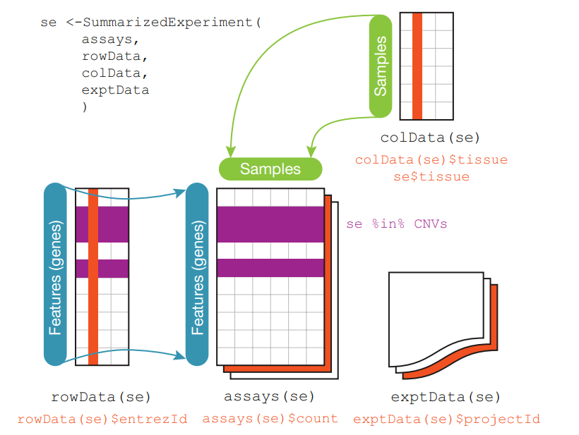

#

## Week 1

1. Reproducibe research

Case study:
["Genomic signatures to guide the use of chemotherapeutics"](https://www.nature.com/articles/nm1491)
-> claim that you could use genomic signatures (gene expression signatures) to guide the use of chemotherapeutics. So that you could tell which chemotherapeutic would work best for which person based on their gene expression profiles.

However,

- many of data not avaiable

- many of code not avaiable

- once reserchers got the data and code, it turned out it did not produce the results they had in the paper

- if you runned the code on different days, times, you got different answers (there was random component to the predicitons)

But, some clinical trials had been launched based on paper. People were assigned to chemotherapy possibly erroneously based on original analysis. Led to law suits.

2.  What you need to share research anlysis

    - The raw data set

    - A tidy data set

    - A code book describing each variable and its values in the tidy dataset (technology, units, machines...)

    - An explicit and exact recipe you used to go from 1 -> 2,3 (Code that get raw data and otputs tidy one either R or more preferably R markdown or iPython notebook)

3.  Good practise

    Always add:

            ```{r session info}
            sessionInfo()
            ```

    &

            The document was processed on `r Sys.Date()`.

    at the end of your notebooks.

4.  The three table in genomics

<figure>
  
  <figcaption>Figure 1: From [1]</figcaption>
</figure>

5. Exploratory analysis

### Citations

[1] Huber, W., Carey, V., Gentleman, R. et al. Orchestrating high-throughput genomic analysis with Bioconductor. Nat Methods 12, 115–121 (2015). https://doi.org/10.1038/nmeth.3252

### To read

1. [Points of View columns on data visualization published in Nature Methods](https://blogs.nature.com/methagora/2013/07/data-visualization-points-of-view.html)

2. [Using Microsoft Excel to obscure your data and annoy your readers](https://www.biostat.wisc.edu/~kbroman/presentations/IowaState2013/graphs_combined.pdf)
