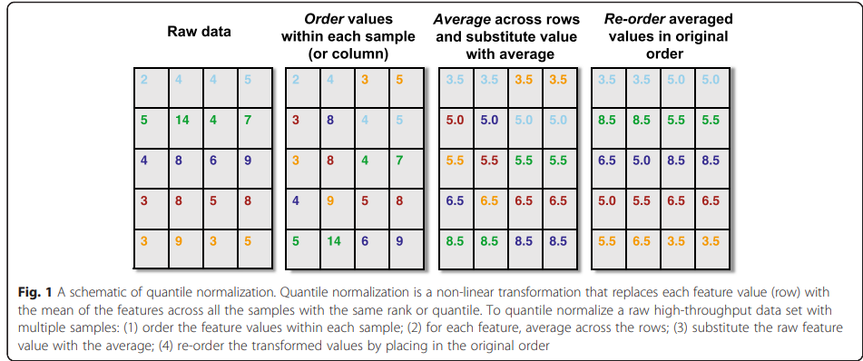

# Statistics for Genomic Data Science

# Johns Hopkins University Taught by: Jeff Leek, PhD

## Week 1

1. Reproducibe research

Case study:
["Genomic signatures to guide the use of chemotherapeutics"](https://www.nature.com/articles/nm1491)
-> claim that you could use genomic signatures (gene expression signatures) to guide the use of chemotherapeutics. So that you could tell which chemotherapeutic would work best for which person based on their gene expression profiles.

However,

- many of data not avaiable

- many of code not avaiable

- once reserchers got the data and code, it turned out it did not produce the results they had in the paper

- if you runned the code on different days, times, you got different answers (there was random component to the predicitons)

But, some clinical trials had been launched based on paper. People were assigned to chemotherapy possibly erroneously based on original analysis. Led to law suits.

2.  What you need to share research anlysis

    - The raw data set

    - A tidy data set

    - A code book describing each variable and its values in the tidy dataset (technology, units, machines...)

    - An explicit and exact recipe you used to go from 1 -> 2,3 (Code that get raw data and otputs tidy one either R or more preferably R markdown or iPython notebook)

3.  Good practise

    Always add:

            ```{r session info}
            sessionInfo()
            ```

    &

            The document was processed on `r Sys.Date()`.

    at the end of your notebooks.

4.  The three table in genomics

<figure>
  
  <figcaption>Figure 1: From [1]</figcaption>
</figure>

5. Exploratory analysis

## Week 2

### Visualizing data

- often thousands features per sample, so to visualize/see patterns dimetion reduction is nice

  - SVD genes x samples decomposed into:

    - U eigenarrays/left sigular vectors: patterns accross the arrays
    - D singular values - diagonal matrix (signifies how much of the variance is explained by those various patterns ^)
    - V transposed: eigengenes: relationship in column patterns - so patterns across genes

    Properties:

    - columns od Vt/rows of U are orthogonal (uncorellated with each other)

  - Other: Multidimentional scaling, independent components analysis, non-negative matrix factorization
  - More on the topic [here](https://courses.edx.org/courses/course-v1:HarvardX+PH525.3x+1T2018/0b42cffa7c6e4c559bf74f93fb864a59/).
  - prcomp: Principal Component Analysis

- svd, boxplots, outlier analysis

### Making data comparable (Pre-processing & normalization)

- Quantile normalization: force the distributions to be exactly the same

<figure>
  
  <figcaption>Figure 2: From [2]</figcaption>
</figure>

- Preprocessing and normaliztion are **higly platform/problem dependent** :(

### Linear modelling

Full course on that [here](https://www.coursera.org/learn/regression-models).

- case: a continuous outcome, but maybe a not continuous covariate or a categorical covariate or a factor-level covariate

- Adjusting for covariates in linear regression models.

### Batch-effects, Confounders

## Week 3

### Counts data

- The most common distribution to model counts is Poisson. Mean & variance: lambda. So if low mean, then also low variance, when you increase the mean you will increase the probability.
  Nice property: always positive.

Most popular techniques:

1. edgeR
2. DEseq (local regression)

More here [Generalized Linear Models](https://grodri.github.io/glms/notes/)

### Permutation

-> one of the most widely used tools for assessing statistical significance in genomic studies
-> you do permutation of labels and then you recalculate a T statistic for each gene

By permuting the labels we're sort of making the assumption that the labels don't matter, that GE are independent of the labels, so distribution is same between e.g. responders and non responders. So that T-statistic will actually find any difference if you do this permutation approach, any difference including in the variance or any of the other moments of the data of the generating distribution.

### Pvalues

The p-values almost always go to zero with the sample size. That's another common misinterpretation of the p-value. Just because you got a really small p-value, it doesn't mean that the difference is huge. It could just be that your sample size is really large, and so the variability is small.

### Multiple testing

- with 0.05 cutoff you will get about 1/20 times results statistically significant even though it might not be. e.g. for 10,000 genes:
  10,000 x 0.05 = expected 500 false positives.

Another examaple: suppose I say 50 out of 10,000 genes are significant at 0.05 level.

You would expect 0.05\*10,000=500 false positives. So 50 does not seem good, they are probably mostly false positives.

But if we are talking 0.05 false discovery rate, then 0.05\*50 = 2.5 false positives expected.

And if family wise error rate - then p of at least 1 false positive <= 0.05.

### Correction

1. Bonferroni Correction (for family wise)
   pvalues less than 0.05/m are significant (m=# of tests)

2. Benjamini-Hochberg Correction (for false discovery rate)
   (a) order the values: p1,p2,..pm (smallest to largest)
   (b) if pi <= 0.05 \* i/m then it is significant

Family wise error usually used when wanting to be sure dicoveries are absolutely most likely to not be false positives. (usually in genomewise association studies, genetics)

False discovery usually for quantitative measurements, like DNA methylation, chip sequencing, gene expression variation. And where you eexpect to see a relatively large number of discoveries.

More on the topic: [Statistical significance for genomewide studies](https://www.ncbi.nlm.nih.gov/pmc/articles/PMC170937/)
Also: [Significance analysis of microarrays applied to the ionizing radiation response](https://www.ncbi.nlm.nih.gov/pmc/articles/PMC33173/)

## Week 4

### Gene set enrichement

- easy to "tell stories" if you aren't careful!
- second multiple testing problem (multiple sets)

### Citations

[1] Huber, W., Carey, V., Gentleman, R. et al. Orchestrating high-throughput genomic analysis with Bioconductor. Nat Methods 12, 115–121 (2015). https://doi.org/10.1038/nmeth.3252

[2] Hicks, S.C., Irizarry, R.A. quantro: a data-driven approach to guide the choice of an appropriate normalization method. Genome Biol 16, 117 (2015). https://doi.org/10.1186/s13059-015-0679-0

### To read

1. [Points of View columns on data visualization published in Nature Methods](https://blogs.nature.com/methagora/2013/07/data-visualization-points-of-view.html)

2. [Using Microsoft Excel to obscure your data and annoy your readers](https://www.biostat.wisc.edu/~kbroman/presentations/IowaState2013/graphs_combined.pdf)
